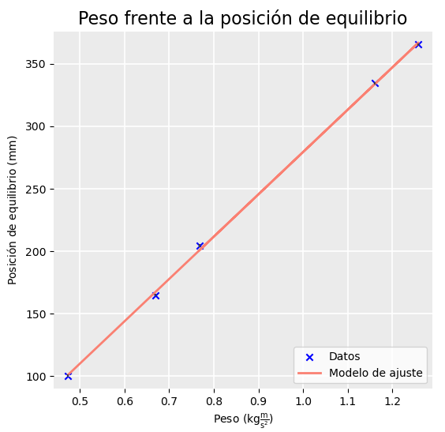
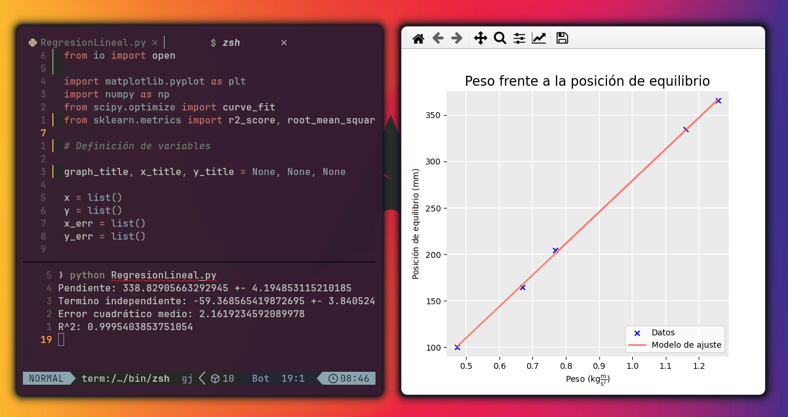

# Script de Regresión Lineal Simple por Mínimos Cuadrados

Este script de Python realiza un ajuste por mínimos cuadrados para establecer
una regresión lineal entre variables. Está diseñado para proporcionar una
herramienta útil en el análisis de datos experimentales, permitiendo una
evaluación cuantitativa precisa de las relaciones entre variables.

## Características

- **Regresión Lineal**: Calcula la mejor línea de ajuste utilizando el método de
  mínimos cuadrados.
- **Análisis Estadístico**: Proporciona estadísticas clave como la pendiente, el
  término independiente, el error cuadrático medio, y el coeficiente de
  determinación (R^2).
- **Visualización de Datos**: Genera un gráfico de la regresión que incluye el
  título, las etiquetas de las variables (extraídas del archivo `datos.txt`), y
  barras de error para cada punto de datos.

## Dependencias

Para ejecutar este script, se requieren las siguientes bibliotecas de Python:

- `matplotlib`: Para la visualización de gráficos.
- `numpy`: Para manipulación y cálculo numérico.
- `scipy`: Utilizado para realizar el ajuste por mínimos cuadrados.
- `sklearn`: Para calcular métricas estadísticas como el error cuadrático medio
  y R^2.

Instala las dependencias con el siguiente comando:

```bash
pip install matplotlib numpy scipy sklearn
```

## Clonar el Repositorio

Para clonar este repositorio y ejecutar el script localmente en tu máquina,
sigue estos pasos:

Abre una terminal o línea de comandos y ejecuta el siguiente comando:

```bash
git clone https://github.com/CodeTartiGreat/RegresionLinealSimple.git
cd RegresionLinealSimple
```

Este comando copiará todos los archivos del repositorio a tu máquina local y
cambiará al directorio del repositorio clonado.

## Configuración del Archivo de Datos

El archivo `datos.txt` debe estructurarse de la siguiente manera para que el
script funcione correctamente:

- La primera línea contiene el título de la gráfica.
- La segunda línea especifica los nombres de las variables X y Y.
- Las líneas subsiguientes enumeran los valores de X y Y junto con sus errores
  correspondientes, separados por punto y coma (`;`).

### Ejemplo de formato del archivo `datos.txt`:

```txt
Título de la Gráfica
Nombre de la Variable X | Nombre de la Variable Y
X1;X1_err               | Y1;Y1_err
X2;X2_err               | Y2;Y2_err
X3;X3_err               | Y3;Y3_err
X4;X4_err               | Y4;Y4_err
```

## Ejecución del Script

Para ejecutar el script, asegúrate de que tanto `RegresionLineal.py` como
`datos.txt` se encuentren en el mismo directorio. Ejecuta el script con el
siguiente comando:

```bash
python RegresionLineal.py
```

## Salida del Script

El script imprimirá en la consola los valores de la pendiente, término
independiente, error cuadrático medio y R^2. También mostrará una gráfica que
ilustra los datos y la línea de regresión ajustada.

## Ejemplo de Salida

```txt
Pendiente: 338.82905663292945 +- 4.194853115210185
Termino independiente: -59.368565419872695 +- 3.8405245948759257
Error cuadrático medio: 2.1619234592089978
R^2: 0.9995403853751054
```
<div align="center">




</div>
